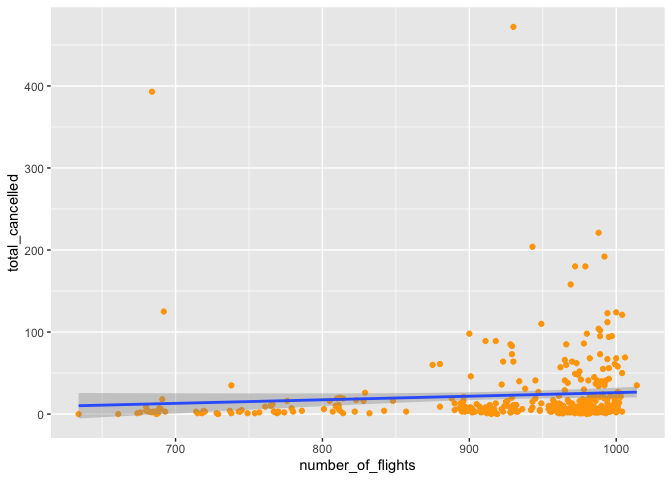
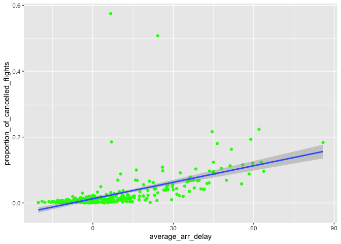

STAT 433 HW1
================
Xinyi Wang
2022-09-22

``` r
library(ggplot2)
library(dplyr)
```

    ## 
    ## 载入程辑包：'dplyr'

    ## The following objects are masked from 'package:stats':
    ## 
    ##     filter, lag

    ## The following objects are masked from 'package:base':
    ## 
    ##     intersect, setdiff, setequal, union

``` r
library(nycflights13)
flights
```

    ## # A tibble: 336,776 × 19
    ##     year month   day dep_time sched_dep_time dep_delay arr_time sched_arr_time
    ##    <int> <int> <int>    <int>          <int>     <dbl>    <int>          <int>
    ##  1  2013     1     1      517            515         2      830            819
    ##  2  2013     1     1      533            529         4      850            830
    ##  3  2013     1     1      542            540         2      923            850
    ##  4  2013     1     1      544            545        -1     1004           1022
    ##  5  2013     1     1      554            600        -6      812            837
    ##  6  2013     1     1      554            558        -4      740            728
    ##  7  2013     1     1      555            600        -5      913            854
    ##  8  2013     1     1      557            600        -3      709            723
    ##  9  2013     1     1      557            600        -3      838            846
    ## 10  2013     1     1      558            600        -2      753            745
    ## # … with 336,766 more rows, and 11 more variables: arr_delay <dbl>,
    ## #   carrier <chr>, flight <int>, tailnum <chr>, origin <chr>, dest <chr>,
    ## #   air_time <dbl>, distance <dbl>, hour <dbl>, minute <dbl>, time_hour <dttm>

1.How many flights have a missing dep_time? What other variables are
missing? What might these rows represent?

``` r
sum(is.na(flights$dep_time)) #number of flights with missing time
```

    ## [1] 8255

``` r
filter(flights, is.na(dep_time)) #filter all of the columns with missing values
```

    ## # A tibble: 8,255 × 19
    ##     year month   day dep_time sched_dep_time dep_delay arr_time sched_arr_time
    ##    <int> <int> <int>    <int>          <int>     <dbl>    <int>          <int>
    ##  1  2013     1     1       NA           1630        NA       NA           1815
    ##  2  2013     1     1       NA           1935        NA       NA           2240
    ##  3  2013     1     1       NA           1500        NA       NA           1825
    ##  4  2013     1     1       NA            600        NA       NA            901
    ##  5  2013     1     2       NA           1540        NA       NA           1747
    ##  6  2013     1     2       NA           1620        NA       NA           1746
    ##  7  2013     1     2       NA           1355        NA       NA           1459
    ##  8  2013     1     2       NA           1420        NA       NA           1644
    ##  9  2013     1     2       NA           1321        NA       NA           1536
    ## 10  2013     1     2       NA           1545        NA       NA           1910
    ## # … with 8,245 more rows, and 11 more variables: arr_delay <dbl>,
    ## #   carrier <chr>, flight <int>, tailnum <chr>, origin <chr>, dest <chr>,
    ## #   air_time <dbl>, distance <dbl>, hour <dbl>, minute <dbl>, time_hour <dttm>

``` r
#is.na() represents the rows with NA values
```

**Therefore, there are 8255 flights having a missing dep_time. The
columns named dep_delay, air_time, arr_time and arr_delay are also
missing, which indicated that the fights might be cancelled.**

2.Currently dep_time and sched_dep_time are convenient to look at, but
hard to compute with because they’re not really continuous numbers.
Convert them to a more convenient representation of number of minutes
since midnight.

``` r
#dep_time %/% 100 gives quotient, multiplying by 60 changes hour to minutes
#dep_time %% 100 gives the remainder, which already is minutes, so adding together is fine
#We need to remove the situations at midnight
#Midnight is at 2400, which is 60*24 minutes after the previous midnight, so it should be considered at 0, so we need to use the remainder function %% to get rid of this special time
flights %>% 
  mutate(dep_time_in_min = (dep_time %/% 100 * 60 + dep_time %% 100) %% 1440,
         sched_dep_time_in_min = (sched_dep_time %/% 100 * 60 + sched_dep_time %% 100) %% 1440) %>%
  select(dep_time, dep_time_in_min, sched_dep_time, sched_dep_time_in_min)
```

    ## # A tibble: 336,776 × 4
    ##    dep_time dep_time_in_min sched_dep_time sched_dep_time_in_min
    ##       <int>           <dbl>          <int>                 <dbl>
    ##  1      517             317            515                   315
    ##  2      533             333            529                   329
    ##  3      542             342            540                   340
    ##  4      544             344            545                   345
    ##  5      554             354            600                   360
    ##  6      554             354            558                   358
    ##  7      555             355            600                   360
    ##  8      557             357            600                   360
    ##  9      557             357            600                   360
    ## 10      558             358            600                   360
    ## # … with 336,766 more rows

3.Look at the number of canceled flights per day. Is there a pattern? Is
the proportion of canceled flights related to the average delay? Use
multiple dyplr operations, all on one line, concluding with
ggplot(aes(x= ,y=)) + geom_point()

``` r
#daily cancelled flights 
cancelled_per_day <- 
  flights %>%
  mutate(cancelled = (is.na(arr_delay) | is.na(dep_delay))) %>%
  group_by(year, month, day) %>%
  dplyr::summarise(
    cancelled_num = sum(cancelled),
    flights_num = n(),
    )
```

    ## `summarise()` has grouped output by 'year', 'month'. You can override using the `.groups` argument.

``` r
flights %>% 
  mutate(cancelled_flights = is.na(flights$arr_delay | flights$dep_delay)) %>% 
  group_by(year, month, day) %>% 
  dplyr::summarise(total_cancelled = sum(cancelled_flights),
                   number_of_flights = n(),) %>% #number of observations 
  ggplot(aes(x = number_of_flights, y = total_cancelled)) +
  geom_point(color = "orange") +
  geom_smooth(method = 'lm')
```

    ## `summarise()` has grouped output by 'year', 'month'. You can override using the `.groups` argument.

    ## `geom_smooth()` using formula 'y ~ x'

<!-- -->

``` r
#number of flights cancelled vs. the total number of flights

flights %>% 
  mutate(cancelled_flights = is.na(flights$arr_delay | flights$dep_delay)) %>% 
  group_by(year, month, day) %>% 
  dplyr::summarise(total_cancelled = sum(cancelled_flights),
                   day) %>% #number of observations 
  ggplot(aes(x = day, y = total_cancelled)) +
  geom_point(color = "pink")+
  geom_smooth(method = 'lm')
```

    ## `summarise()` has grouped output by 'year', 'month', 'day'. You can override using the `.groups` argument.
    ## `geom_smooth()` using formula 'y ~ x'

<!-- -->

**For the pattern, as number of flights per day increases, the total
number of flights been cancelled tends to increase at that day. Also, in
the plot of day vs.total_cancelled, the number of cancelled flights is
inversely proportional to the date.**

``` r
#the question of the proportion of canceled flights related to the average delay
#we would calculate the proportion of canceled flights related to the average departure and arrival delay respectively

#average departure delay vs. proportion of cancelled flights
flights %>% 
  mutate(cancelled_flights = is.na(arr_delay | dep_delay)) %>%
  group_by(year, month, day) %>%
  summarize(average_dep_delay = mean(dep_delay, na.rm = TRUE),
           proportion_of_cancelled_flights = mean(cancelled_flights)) %>%
  ggplot(mapping = aes(x = average_dep_delay, y = proportion_of_cancelled_flights)) +
  geom_point(color = "purple") + 
  geom_smooth(method = 'lm')
```

    ## `summarise()` has grouped output by 'year', 'month'. You can override using the `.groups` argument.

    ## `geom_smooth()` using formula 'y ~ x'

<!-- -->

``` r
#average arrival delay vs. proportion of cancelled flights
flights %>% 
  mutate(cancelled_flights = is.na(arr_delay | dep_delay)) %>% 
  group_by(year, month, day) %>%
  summarize(average_arr_delay = mean(arr_delay, na.rm = TRUE),
            proportion_of_cancelled_flights = mean(cancelled_flights)) %>%
  ggplot(mapping = aes(x = average_arr_delay, y = proportion_of_cancelled_flights)) +
  geom_point(color = "green") + 
  geom_smooth(method = 'lm')
```

    ## `summarise()` has grouped output by 'year', 'month'. You can override using the `.groups` argument.

    ## `geom_smooth()` using formula 'y ~ x'

<!-- -->

**In the two graphs with the blue fitting lines, the canceled flights is
proportional to average departure delay and average arrival delay since
as the average departure delay or average arrival delay increases, the
proportion of the cancelled flights tends to increase.**
